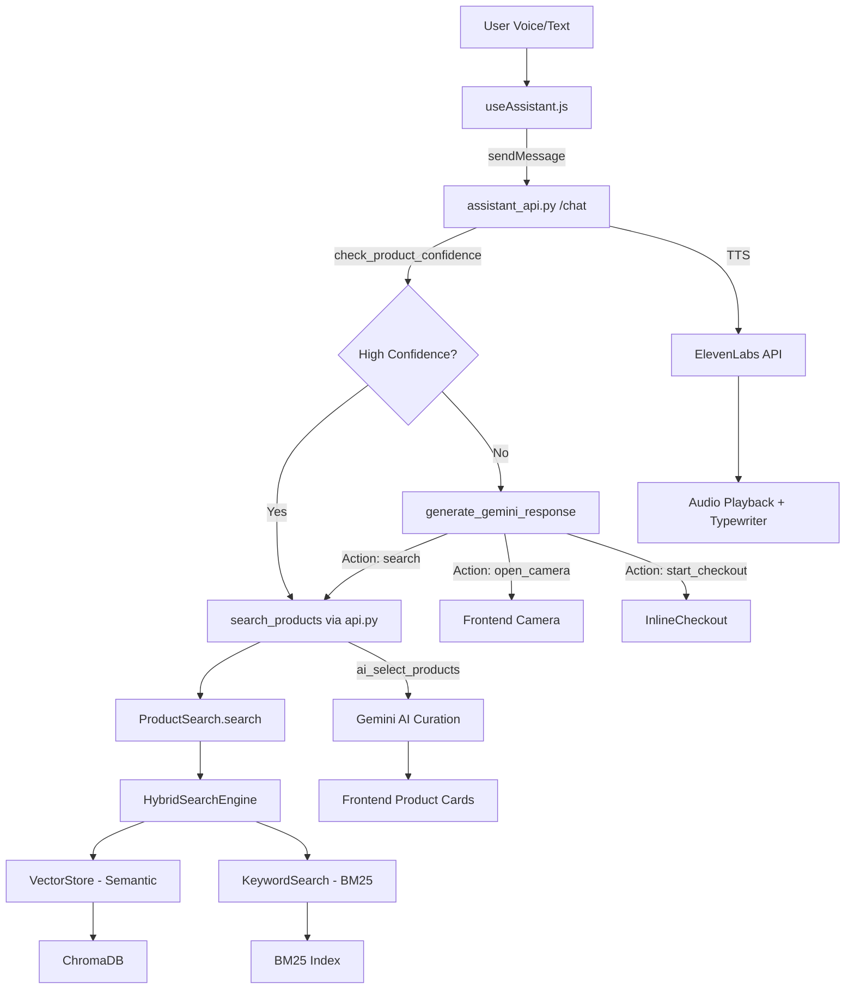

# Codebase Index — AI Shopping Assistant

> **Last updated**: 2026-02-28  
> **Tech Stack**: Python 3.13 · Flask · FastAPI · ChromaDB · Gemini AI · React · Vite · MUI · ElevenLabs TTS

---

## Project Structure

```
shopify_rag/
├── .env                          # Environment variables (API keys, config)
├── .env.example                  # Template for .env
├── requirements.txt              # Python dependencies
├── products.json                 # Cached Shopify product data (~9 MB)
├── chroma_db/                    # Persisted ChromaDB vector database
│
├── ── BACKEND (Python) ──────────────────────────────────
├── config.py                     # Centralized configuration
├── shopify_fetcher.py            # Shopify Admin API product fetcher
├── data_processor.py             # Product → searchable document converter
├── embeddings.py                 # Sentence-transformer embedding generator
├── vector_store.py               # ChromaDB vector storage & search
├── keyword_search.py             # BM25 keyword search engine
├── hybrid_search.py              # Semantic + keyword hybrid search
├── search.py                     # High-level search interface
├── api.py                        # FastAPI REST API (port 8000)
├── assistant_api.py              # Flask AI assistant (port 8001)
├── shopping_profiles.json        # LOCAL DB: Persistent user preferences
├── setup.py                      # First-run setup wizard
│
├── ── FRONTEND (React + Vite) ───────────────────────────
├── frontend_react/
│   ├── src/
│   │   ├── App.jsx                # Main app (UI layout, routing, state)
│   │   ├── main.jsx               # React entry point
│   │   ├── hooks/
│   │   │   └── useAssistant.js    # Core hook (voice, chat, cart, TTS)
│   │   ├── components/
│   │   │   ├── OrbVisualizer.jsx  # Siri-like canvas orb animation
│   │   │   ├── CartModal.jsx      # Simple cart popup modal
│   │   │   ├── CartDrawer.jsx     # Full-featured cart drawer
│   │   │   ├── CheckoutScreen.jsx # Modal checkout with price breakdown
│   │   │   ├── OrderSuccessScreen.jsx  # Animated order confirmation
│   │   │   └── checkout/          # Inline conversational checkout
│   │   │       ├── InlineCheckout.jsx  # Stage router
│   │   │       ├── CartReview.jsx      # Stage 1: Review cart
│   │   │       ├── AddressForm.jsx     # Stage 2: Delivery details
│   │   │       ├── PaymentReview.jsx   # Stage 3: Payment & confirm
│   │   │       └── OrderSuccess.jsx    # Stage 4: Success animation
│   │   └── lib/
│   │       └── utils.js           # Utility helpers
│   └── vite.config.js             # Vite build config
│
├── ── LEGACY / STANDALONE HTML ──────────────────────────
├── frontend.html                  # Standalone HTML frontend (24 KB)
├── assistant.html                 # Assistant HTML frontend
├── assistant.js                   # Assistant client-side JS
│
├── ── DOCS & EXAMPLES ───────────────────────────────────
├── DOCS/
│   ├── OVERVIEW.md                # Project overview
│   ├── BACKEND_MODEL.md           # Backend architecture
│   ├── API_REFERENCE.md           # API endpoints reference
│   ├── FRONTEND_UX.md             # Frontend UX documentation
│   └── RAG_ENGINE.md              # RAG engine architecture
├── examples/
│   ├── basic_search.py            # Search usage examples
│   └── rag_query.py               # RAG query examples
├── README.md                      # Project readme
├── HYBRID_SEARCH.md               # Hybrid search documentation
└── project_architecture_overview.md  # Architecture overview
```

---

## Backend Files

### `config.py` — Configuration Manager
| Element | Type | Description |
|---------|------|-------------|
| `Config` | Class | Centralized configuration loaded from `.env` |
| `Config.SHOPIFY_SHOP_URL` | Field | Shopify store URL |
| `Config.SHOPIFY_ACCESS_TOKEN` | Field | Shopify Admin API token |
| `Config.CHROMA_PERSIST_DIRECTORY` | Field | ChromaDB storage path (`./chroma_db`) |
| `Config.EMBEDDING_MODEL` | Field | Sentence-transformer model (`all-MiniLM-L6-v2`) |
| `Config.validate()` | Method | Validates required API keys exist |
| `Config.get_shopify_headers()` | Method | Returns auth headers for Shopify API |

---

### `shopify_fetcher.py` — Shopify Product Fetcher
| Element | Type | Description |
|---------|------|-------------|
| `ShopifyFetcher` | Class | Fetches products from Shopify Admin API |
| `get_all_products(limit)` | Method | Paginated fetch of all products (handles rate limits) |
| `save_products(products, filename)` | Method | Saves products to `products.json` |
| `load_products(filename)` | Method | Loads products from cached JSON file |

---

### `data_processor.py` — Product Data Processor
| Element | Type | Description |
|---------|------|-------------|
| `ProductDataProcessor` | Class | Converts raw Shopify data into searchable documents |
| `extract_product_text(product)` | Method | Extracts searchable text (title, description, tags, variants) |
| `extract_metadata(product)` | Method | Extracts filterable metadata (price, vendor, type, images) |
| `process_products(products)` | Method | Batch processes products into `{text, metadata}` documents |

---

### `embeddings.py` — Embedding Generator
| Element | Type | Description |
|---------|------|-------------|
| `EmbeddingGenerator` | Class | Generates vector embeddings using `sentence-transformers` |
| `generate_embedding(text)` | Method | Single text → vector embedding |
| `generate_embeddings(texts, batch_size)` | Method | Batch text → vector embeddings |
| `get_embedding_dimension()` | Method | Returns embedding vector dimension (384 for MiniLM) |

---

### `vector_store.py` — ChromaDB Vector Store
| Element | Type | Description |
|---------|------|-------------|
| `VectorStore` | Class | Manages ChromaDB collection for product embeddings |
| `add_documents(documents, batch_size)` | Method | Embeds and stores documents (cleans metadata for ChromaDB) |
| `search(query, n_results, where_filter)` | Method | Semantic similarity search with optional metadata filters |
| `delete_collection()` | Method | Deletes the entire ChromaDB collection |
| `reset_collection()` | Method | Deletes and recreates the collection |
| `get_stats()` | Method | Returns collection name, doc count, persist directory |

---

### `keyword_search.py` — BM25 Keyword Search
| Element | Type | Description |
|---------|------|-------------|
| `KeywordSearchEngine` | Class | BM25-based keyword search with field weighting |
| `__init__(documents, field_weights)` | Method | Builds BM25 indexes per field (title, description, tags, etc.) |
| `_tokenize(text)` | Method | Tokenizes text into lowercase words |
| `_build_indexes()` | Method | Creates per-field BM25 indexes |
| `search(query, top_k, field_weights)` | Method | Multi-field weighted BM25 search |
| `search_field(query, field, top_k)` | Method | Search within a single field |
| `get_field_matches(query, document_index)` | Method | Per-field match score breakdown |

---

### `hybrid_search.py` — Hybrid Search Engine
| Element | Type | Description |
|---------|------|-------------|
| `HybridSearchEngine` | Class | Combines semantic (vector) + keyword (BM25) search |
| `__init__(vector_store, documents, ...)` | Method | Initializes with configurable semantic/keyword weights |
| `_normalize_scores(scores)` | Method | Min-max normalization to [0, 1] |
| `search(query, top_k, ...)` | Method | Hybrid search with exact-match boosting |
| `explain_score(result)` | Method | Human-readable score explanation |

---

### `search.py` — High-Level Search Interface
| Element | Type | Description |
|---------|------|-------------|
| `ProductSearch` | Class | Unified search interface (auto-initializes hybrid engine) |
| `search(query, top_k, min_score, ...)` | Method | Main search method (hybrid or semantic fallback) |
| `search_by_price_range(query, min, max)` | Method | Price-filtered search |
| `search_by_category(query, type, vendor)` | Method | Category-filtered search |
| `get_similar_products(product_id)` | Method | Find products similar to a given product |
| `format_result(result)` | Method | Formats result for display |

---

### `api.py` — FastAPI REST API (Port 8000)
| Endpoint | Method | Description |
|----------|--------|-------------|
| `/` | GET | Root — lists available endpoints |
| `/health` | GET | Health check with document count |
| `/search` | POST | Semantic/hybrid product search |
| `/search` | GET | Browser-friendly GET search |
| `/stats` | GET | Vector store statistics |
| `/index` | POST | Index/re-index products from Shopify |

**Pydantic Models**: `SearchRequest`, `SearchResponse`, `IndexRequest`, `StatsResponse`

---

### `assistant_api.py` — Flask AI Assistant API (Port 8001)

#### Core Functions
| Function | Description |
|----------|-------------|
| `chat()` | Main chat endpoint — handles user messages, AI responses, actions |
| `generate_gemini_response(messages)` | Sends messages to Gemini Pro for AI response |
| `search_products(query, limit)` | Calls RAG API to search products |
| `check_product_confidence(user_message)` | Scores how well a message matches a specific product (0-1 threshold) |
| `ai_select_products(request, products)` | Uses Gemini to pick the best 1-2 products from search results |
| `detect_brand_leak(text)` | Guards against mentioning competitor brands |

#### Shopify Integration
| Function | Description |
|----------|-------------|
| `create_draft_order(email, address, items)` | Creates a Shopify draft order |
| `complete_draft_order(draft_order_id)` | Completes a draft order (COD) |
| `extract_variant_ids(products)` | Extracts variant IDs for Shopify line items |
| `get_customer_by_email(email)` | Looks up existing Shopify customer |

#### Session & Cart
| Endpoint | Method | Description |
|----------|--------|-------------|
| `/api/assistant/new_session` | POST | Creates a new conversation session |
| `/api/assistant/end_session/<id>` | DELETE | Ends a session |
| `/api/assistant/chat` | POST | Main chat endpoint |
| `/api/assistant/cart/add` | POST | Add item to cart |
| `/api/assistant/cart` | GET | Get cart contents |
| `/api/assistant/cart/clear` | POST | Clear all cart items |
| `/api/assistant/tts` | POST | Text-to-Speech via ElevenLabs |
| `/api/assistant/vision` | POST | Image analysis via Gemini Vision |
| `/api/assistant/select_product` | POST | Track product selection |

#### AI System Prompt States
| State | Purpose |
|-------|---------|
| STATE 1: INVESTIGATOR | Understand user needs through natural conversation (no brand names) |
| STATE 2: SEARCHER | Build optimized search query from conversation context |
| STATE 3: PRESENTER | Recommend products strictly from search results |
| STATE 4: ORDER | Collect checkout details (name, email, address) |

#### AI Actions
| Action | Trigger |
|--------|---------|
| `search` | User describes what they want |
| `open_camera` | User wants to show a product |
| `start_checkout` | User says "checkout", "buy this", "place order" |
| `add_to_cart` | User says "add to cart" |

---

### `setup.py` — Setup Wizard
| Function | Description |
|----------|-------------|
| `check_env_file()` | Validates `.env` exists and has required keys |
| `install_dependencies()` | Checks Python packages are installed |
| `fetch_products()` | Fetches products from Shopify |
| `index_products(products)` | Processes and indexes into ChromaDB |
| `run_test_search()` | Runs a test search to verify setup |

---

## Frontend Files

### `App.jsx` — Main Application Component
| Element | Type | Description |
|---------|------|-------------|
| `App` | Component | Root component: layout, header, content area, controls |
| `handleCapture()` | Function | Captures camera frame and sends for vision analysis |
| `toggleMic()` | Function | Starts/stops voice recognition |
| `handleSubmit(e)` | Function | Handles text input submission |
| `endSession()` | Function | Cleans up and ends the conversation session |

**UI Sections**: Header with cart badge → Dynamic content area (Orb / Camera / Products / Checkout) → Controls bar (keyboard, mic, end call) → Text input slide-up

---

### `useAssistant.js` — Core Assistant Hook
| Export | Type | Description |
|--------|------|-------------|
| `status` | State | Current status text ("Ready", "Speaking...", etc.) |
| `isListening` | State | Whether mic is actively recording |
| `isSpeaking` | State | Whether TTS audio is playing |
| `isThinking` | State | Whether waiting for AI response |
| `products` | State | Array of search result products |
| `cartItems` / `cartCount` | State | Cart contents and count |
| `checkoutStage` | State | Current checkout stage (`null`/`review`/`address`/`payment`/`success`) |
| `liveUserText` / `liveAiText` | State | Real-time transcript text |
| `isCameraOpen` | State | Whether camera view is active |
| `startListening()` | Function | Starts Web Speech API recognition |
| `stopListening()` | Function | Stops recognition |
| `sendMessage(text)` | Function | Sends text to assistant API |
| `analyzeImage(blob)` | Function | Sends captured image for vision analysis |
| `handleResponse(data)` | Function | Processes API response (actions, products, checkout) |
| `speak(text)` | Function | TTS playback with typewriter text animation |
| `addToCart(product)` | Function | Adds product to cart via API |
| `viewCart()` | Function | Fetches cart contents from API |
| `clearCart()` | Function | Clears all cart items |
| `selectProduct(id, action)` | Function | Tracks product selection |

---

### UI Components

| Component | File | Props | Purpose |
|-----------|------|-------|---------|
| `OrbVisualizer` | `OrbVisualizer.jsx` | `isListening, isSpeaking, isThinking, analyser` | Canvas-based audio-reactive orb animation |
| `CartModal` | `CartModal.jsx` | `open, onClose, cartItems, cartCount, onClear` | Simple modal showing cart items |
| `CartDrawer` | `CartDrawer.jsx` | `open, onClose, cartItems, cartCount, updateCartItem, removeFromCart, onCheckout` | Full side drawer with quantity controls |
| `CheckoutScreen` | `CheckoutScreen.jsx` | `open, onClose, cartItems, onPlaceOrder` | Modal checkout with price breakdown (subtotal, GST, delivery) |
| `OrderSuccessScreen` | `OrderSuccessScreen.jsx` | `open, onClose, orderNumber, total` | Animated success confirmation with checkmark pop |

### Inline Checkout Components (`checkout/`)

| Component | File | Props | Purpose |
|-----------|------|-------|---------|
| `InlineCheckout` | `InlineCheckout.jsx` | `stage, cartItems, onNext, onComplete, onCancel` | Stage router — renders correct checkout step |
| `CartReview` | `CartReview.jsx` | `cartItems, onNext, onCancel` | Stage 1: Item list, subtotal, tax, delivery, total |
| `AddressForm` | `AddressForm.jsx` | `onNext, onBack` | Stage 2: Name, email, phone, address fields |
| `PaymentReview` | `PaymentReview.jsx` | `cartItems, onPlaceOrder, onBack` | Stage 3: Final summary + payment method + place order |
| `OrderSuccess` | `OrderSuccess.jsx` | `orderNumber, onContinue` | Stage 4: Animated checkmark + order confirmation |

---

## Data Flow



---

## Environment Variables

| Variable | Service | Description |
|----------|---------|-------------|
| `GEMINI_API_KEY` | Google AI | Gemini Pro & Vision API key |
| `ELEVENLABS_API_KEY` | ElevenLabs | Text-to-Speech API key |
| `ELEVENLABS_VOICE_ID` | ElevenLabs | Selected voice for TTS |
| `SARVAM_API_KEY` | Sarvam AI | Alternative TTS provider (configured but not active) |
| `SHOPIFY_STORE_URL` | Shopify | Store domain |
| `SHOPIFY_ACCESS_TOKEN` | Shopify | Admin API access token |
| `SHOPIFY_API_VERSION` | Shopify | API version (`2025-10`) |

---

## Running the Application

```bash
# Terminal 1 — RAG Search API (port 8000)
source venv/bin/activate && python api.py

# Terminal 2 — AI Assistant API (port 8001)
source venv/bin/activate && python assistant_api.py

# Terminal 3 — React Frontend (port 5173)
cd frontend_react && npm run dev
```
